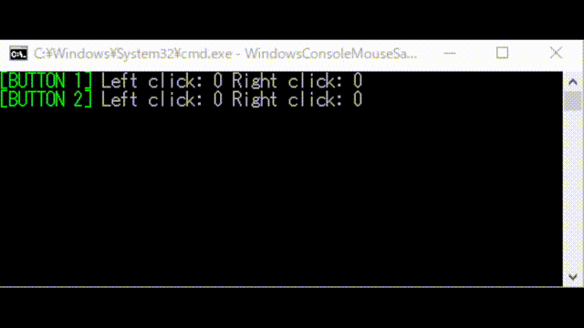

# WindowsConsoleMouseSample

Windowsのコマンドプロンプトでマウス入力を受け付けるサンプルコード

`ReadConsoleInput` APIを使うと、コマンドプロンプト上で動作しているアプリからマウスのクリックや移動を取得することができる。特に実用性はないし、Linux等との互換性もない。

Sample code to accept mouse input at the Windows command prompt

The `ReadConsoleInput` API can be used to get mouse clicks and movements from applications running on the command prompt. It is not particularly practical, nor is it compatible with Linux, etc.
